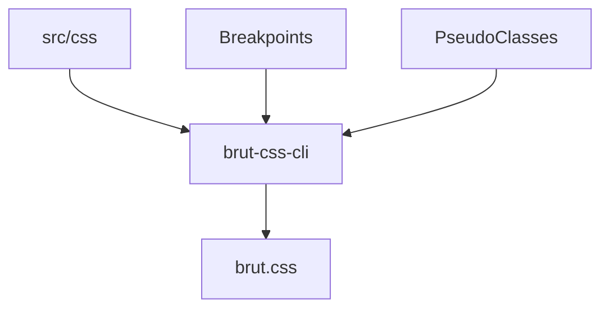

# Brut CSS - A simple utility CSS library get you started

This is a utility CSS library that provides single-purpose classes you can use together to prototpye and
design directly in your HTML or HTML-generation code.  But it is minimal.

It mostly exists to be included with BrutRB to allow developers to immediately start creating usable UI or
HTML without having to install and setup something else.  It can also be the basis of a real CSS solution
for a real app.

## Install

## Usage

## Development

The overall design of this library is that a core set of properties and styles exist in `src/css`.  These
can then be examined to produce various actual CSS styles used in a final stylesheet a developer can
include.

For example, we have three breakpoints: default, medium, large, and not-small.  From `src/css`, we might
parse the class `pa-2`, which is padding at the second smallest size.  From there, we can create `pa-2`, `pa-2-m`, `pa-2-l`, and `pa-2-ns` that would apply only at the given breakpoints.

In a general sense, the styles + a breakpoint config + a pseudo class configuration can produce a single
stylesheet with single-purpose styles for all those combinations:



### Breakpoint Config

A breakpoint config tells `brut-css-cli` what breakpoints will be supported.  BrutCSS applies these to all
styles, so there is not a way to apply breakpoint configuration to only some styles.

The config file is a `.breakpoint-config.css` file, which is CSS that contains empty media queries.  Each
media query must be preceded by a comment that defines the suffix to use for classes. This is defined by
the `@suffix` tag.  Additional documentation may be provided about the meaning or purpose of the media
query.

Here's an example that shows "medium", "large", and "not small" width-based breakpoints.

```css
/* Not-small screens, essentially anything that is likely not a mobile device.
 * @suffix ns
 */
@media screen and (min-width: 30em) {
}
/* Medium-sized screens.
 * @suffix m
 */
@media screen and (min-width: 30em) and (max-width: 60em) {
}
/* Large screens.
 * @suffix l
 */
@media screen and (min-width: 60em) {
}
```

Note that using media queries for things unrelated to size (such as reduced motion or high contrast) can
result in a somewhat inconvienient set of classes, that can't be easily applied to a width-based
situation.  It is currently recommended that if these media queries or meaningful, you apply them in your
app in a more traditional way:

```css
/* Your app's app/src/front_end/css/styles.css */
@media (prefers-contrast: more) {
  .fw-1 {
    font-weight: 400; /* Normally would be 100 */
  }
  .fw-2 {
    font-weight: 400; /* Normally would be 200 */
  }
  .fw-3 {
    font-weight: 400; /* Normally would be 300 */
  }
}
```

### Pseudo Class config

Pseudo-classes, such as `:hover` can be useful in some situations, so having a utility for them is
possible.  In BrutCSS, pseudo-classes a prefixes, so `hover-blue-300` would apply `blue-300` only on
hover.

Because many pseudo classes aren't relevant or commonly-used for all styles, Your pseudo-class
configuration must opt into classes based on the files used in Brut's `src/css/*.css` structure.

This configuration file uses the proprietary `@`-rule, `@brut-pseudo` which accepts two arguments: the
the pseudo class and the prefix to use.  It accepts a block that contains one or more `@brut-pseudo-file`
`@`-rules that themselves take on argument: the file on which the styles will apply.

For example, this will set up a hover pseudo-class for colors:

```css
@brut-pseudo(hover hov) {
  @brut-pseudo-file(colors.css);
}
```

This would create css like so:

```css
hov-red-400:hover {
  color: var(--red-400);
}
```

The `@brut-pseudo` can be surrounded by a media query that will be carried through to the defined styles.
For example, if you don't want hover states to be in effect for devices whose primary input method doesn't
support them, you'd do this:

```css
@media (hover: hover) {
  @brut-pseudo(hover hov) {
    @brut-pseudo-file(colors.css);
  }
}
```

This would create css like so:

```css
@media (hover: hover) {
  hov-red-400:hover {
    color: var(--red-400);
  }
  /* And all other hov-prefixes CSS */
}
```
