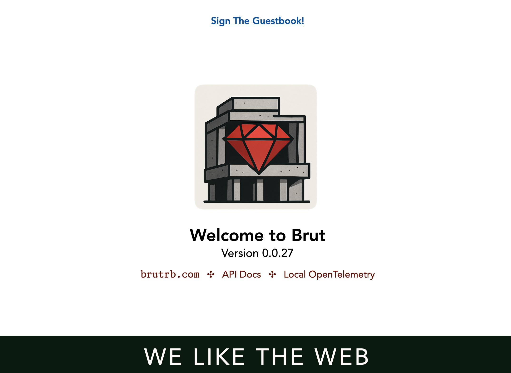

# mkbrut - Create a new Brut App

`mkbrut` is how you go from zero to having a Brut app where you can start working.

## Installation

There are two ways to install `mkbrut`: Docker (recommended) and RubyGems.

### Docker (recommended)

1. Install Docker
2. Use `docker` to run `mkbrut`:

   ```
   docker run --pull always \
              -v "$PWD":"$PWD" \
              -w "$PWD" 
              -it \
              thirdtank/mkbrut \
              mkbrut -h
   ```

[Why is this recommended?](#why-is-docker-recommended)

### RubyGems

1. Ensure you have Ruby 3.4 installed
2. `gem install mkbrut`
3. `mkbrut -h`

## Usage

```
docker run --pull always \
           -v "$PWD":"$PWD" \
           -w "$PWD" 
           -it \
           thirdtank/mkbrut \
           mkbrut my-new-app
```

(or, if using RubyGems):

```
mkbrut my-new-app
```

This will create a new Brut app, including a development environment.

It will output instructions to start the dev environment and start the app:

1. Ensure Docker is installed
2. `dx/build` - build image where app and tests etc will run.
3. `dx/start` - start up container use said image + other containers for e.g Postgres
4. In a new terminal, `dx/exec bash`
5. You are now "logged into" the container where you can run the app. Note that you
   can use an editor on your computer to edit the code - you just need to run all
   commands inside the container"
6. `bin/setup`
7. `bin/dev`
8. Open `http://localhost:6502`:

   

*Note* that you can run the commands from your computer with `dx/exec` more directly if you like:

* `dx/exec bin/setup`
* `dx/exec bin/dev`
* etc.

Read more at [brutrb.com](https://brutrb.com).

The app will have some demo features to show you around the framework. To get a bare bones new app, use `--no-demo`:

```
docker run  -v "$PWD":"$PWD" -w "$PWD" -it thirdtank/mkbrut mkbrut my-new-app --no-demo
```

(or, if using RubyGems):

```
mkbrut my-new-app --no-demo
```

You can also customize some aspects of your app once start to have an opinion about
it:


```
docker run  -v "$PWD":"$PWD" -w "$PWD" -it thirdtank/mkbrut mkbrut \
  --app-id=new-app \
  --organization=cyberdyne \
  --prefix=ap \
  my-new-app
```

(or, if using RubyGems):

```
mkbrut \
  --app-id=new-app \
  --organization=cyberdyne \
  --prefix=ap \
  my-new-app
```

* `--app-id` The identifier for your app, suitable for use as a hostname or other internet-safe identifier.
* `--organization` This is your organization name you might use on GitHub, DockerHub, or WhateverHub.
* `--prefix` The two-character prefix for all external IDs of your database tables that opt into external IDs as well as any autonomous custom elements you might make

### Why is Docker Recommended?

The [Docker image](https://hub.docker.com/repository/docker/thirdtank/mkbrut/general)
is entirely self-contained and is the most guaranteed to work.  Plus, it avoids you
having to figure out how to install RUby 3.4 on your computer.

It *does* require a very cumbersom command-line invocation (explained below), but you
are likely not creating lots of Brut apps every day (and, if you were, `alias` exists).

The command-line invocation is cumbersome, but here is why everything is the way it
is:

* `docker run ` - Tells Docker to use an image to start a container to run a
command
* `--pull always` - Pulls a fresh image from DockerHub to ensure you have the
actual latest version.
* `-v "$PWD":"$PWD"` - Makes your current directory available inside the Docker container as the same path, so that files written inside the container show up on your computer.
* `-w "$PWD"` - Run all commands inside your current directory
* `-it` - Create an interactive TTY, which causes `mkbrut` to behave "normally"
* `thirdtank/mkbrut` - name of the image to run.  This name implies, and is identical to, `thirdtank/mkbrut:latest`, keeping in mind that `latest` is only the actual latest if you used `--pull always`. Docker gonna Docker.
* `mkbrut -h` - command to run inside the container

## Developing

`mkbrut` has a Docker-based dev environment:

1. Install Docker
2. `dx/build`
3. `dx/start`
4. Open a new terminal:
   1. `dx/exec bash`
   2. You are now inside a running Docker container:
      1. `bin/setup`
      2. `bundle exec exe/mkbrut -h`

